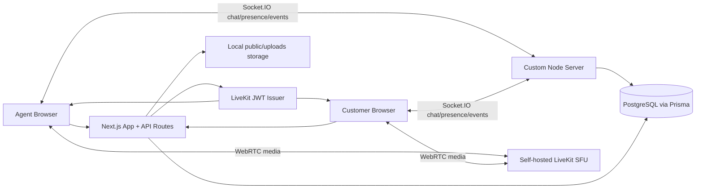

# AtomQuest Hackathon 1.0 - Real-Time Video Support Platform

A demo-ready support platform built with Next.js 15, TypeScript, Prisma/PostgreSQL, Socket.IO, and a self-hosted LiveKit SFU in Docker. No hosted video API is used; browser media joins a LiveKit server that you run and control.

## Demo Credentials

Agent email: `agent@atomquest.dev`
Password: `password123`

## Setup

```bash
cp .env.example .env
docker compose up -d
npm install
npx prisma migrate dev --name init
npm run prisma:seed
npm run dev
```

Open `http://localhost:3000`.

## Demo Flow

1. Log in as the agent.
2. Create a support session from the dashboard.
3. Copy the customer invite link and open it in another browser/profile.
4. Customer enters a name and joins without login.
5. Agent joins the same call.
6. Use audio/video controls, chat, file sharing, and participant presence.
7. Agent starts recording, selects the browser tab/window, stops recording, and the file uploads.
8. Agent ends the session.
9. Open session details/history to review participants, timestamps, chat, files, recordings, and event logs.
10. Open `/admin` for metrics and session/event visibility.

## Architecture



## Why LiveKit Satisfies Owned Media Server

The video path uses the open-source LiveKit server from `docker-compose.yml`. LiveKit runs locally as our own SFU/media server on ports `7880`, `7881`, and `7882/udp`. The app only issues room tokens through our Next API and participants publish/subscribe media to this self-hosted server. It does not call hosted providers such as Twilio, Agora, Daily, Vonage, or LiveKit Cloud.

## Feature Map

- Agent demo login with signed HTTP-only cookie session.
- Agent dashboard to create sessions, copy invite links, join/end sessions, and view history.
- Invite-token customer join with no login.
- LiveKit browser call with audio/video controls, leave/end behavior, and self-hosted SFU routing.
- Role enforcement for session creation/end and recording controls.
- Socket.IO chat and presence with database persistence.
- Participant join/reconnecting/left tracking with 30-second reconnect grace.
- Session status, duration, event logs, history view, admin metrics dashboard.
- File sharing with local uploaded links under `public/uploads`.
- Browser MediaRecorder MVP for recording upload.
- `/api/metrics` JSON endpoint: `activeSessions`, `connectedParticipants`, `totalSessions`, `totalMessages`, `errorCount`.

## Known Limitations

- Recording is a hackathon MVP: the agent records a browser-selected tab/window using `getDisplayMedia`, then uploads a WebM after stop. It is not server-side SFU compositing or LiveKit Egress.
- Local file storage is suitable for demo only. Production should use object storage with signed URLs, malware scanning, and retention rules.
- Auth is intentionally minimal for the demo account. Production should add stronger session rotation, CSRF hardening, password reset, audit policy, and multi-agent tenant controls.
- LiveKit config is local-development oriented and does not include TURN/TLS/public IP tuning needed for internet deployment.

## Useful Commands

```bash
npm run lint
npm run typecheck
npm run build
npm run dev
```
